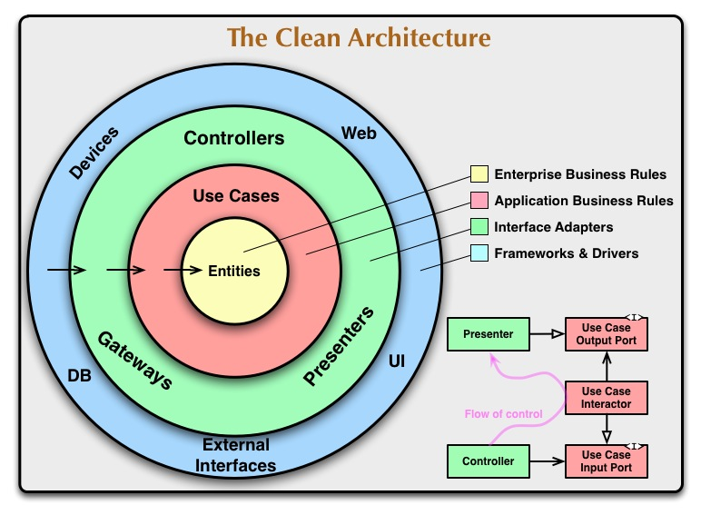
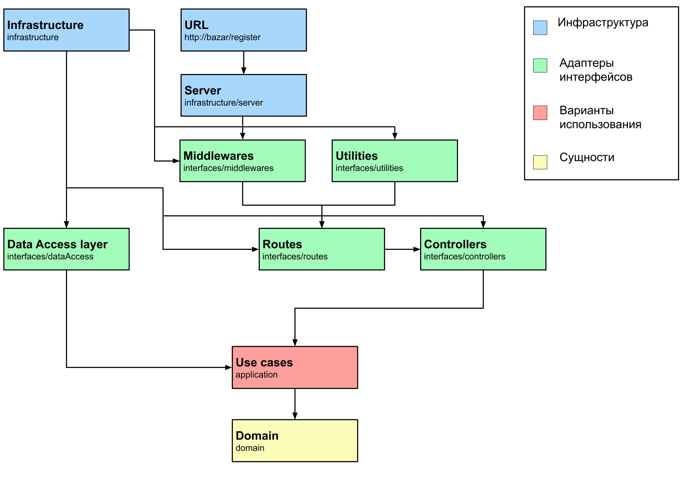

# Bazar -- Интернет магазин мебели
Сделано Денисовым Даниилом на стеке: PostgreSQL, PUG, Express, Node.js.
Посмотреть на рабочий сайт можно здесь -> 


## Что это?

Данный проект представляет собой многостраничный сайт с 
широким функционалом для покупки мебели и заказа мебельных услуг.

### Реализованный функционал:

* Интернализация для двух языков
* Интернализация валют (поддержка 3 валют)
* Идентификация пользователей 
* Каталоги для мебели и услуг
* Фильтрация и сортировка в каталогах
* Оформление мебели и услуг
* Личный кабинет с просмотром заказов и изменением личной информации 
* Корзина и "Избранное"
* Сравнение мебели по характеристикам
* Отзывы к товарам и услугам 
* Блог со статьями

### Функционал на подходе:

* Поиск по всем товарам
* Быстрый просмотр мебели
* Распараллеливание экземпляров


## Архитектура проекта

Проект реализован на основе DDD (Предметно-ориентированное проектирование) и
следует принципам cлоистой «чистой архитектуры» Роберта Мартина.



### Структура проекта

```javascript
├── application                         // Уровень прикладных бизнес правил (Варианты использования)
│   ├── cartUseCases                    // Варианты использования для корзины
│   ├── checkoutProductsUseCases        // Варианты использования для покупок мебели
│   ├── checkoutServiceUseCases         // Варианты использования для покупок услуг
│   ├── favoritesUseCases               // Варианты использования для избранных товаров
│   ├── getFilteredProducts.js          // Варианты использования для фильтрации
│   ├── getFilteredServices.js          // Варианты использования для фильтрации
│   ├── productsReviewsUseCases         // Варианты использования для отзывов
│   ├── servicesReviewsUseCases         // Варианты использования для отзывов
│   └── userUseCases                    // Варианты использования для авторизации пользователей
|
├── domain                              // Уровень сущностей (Критические бизнесправила)
│   ├── Cart.js                         // Сущность для корзины
│   ├── CheckoutProducts.js             // Сущность для покупок мебели
│   ├── CheckoutService.js              // Сущность для покупок услуг
│   ├── Favorites.js                    // Сущность для избранных
│   └── User.js                         // Сущность для пользователей
├── index.js                            // Основная точка входа в приложение
├── infrastructure                      // Уровень инфраструктуры
|
├── interfaces                          // Уровень адаптеров интерфейсов
│   ├── controllers                     // Контроллеры
│   ├── dataAccess                      // Уровень доступа к данным
│   ├── middlewares                     // Промежуточное программное обеспечение сервера
│   ├── routeValidators                 // URI Валидаторы
│   ├── routes                          // Маршруты сервера
│   ├── server                          // Методы для работы с сервером
│   │   ├── index.js
│   │   └── router.js                   // Маршрутизатор путей сервера и Middlewares
│   └── utilities                       // Утилиты сервера
├── locales                             // Локали для языков
├── pagesQueries                        // Запросы для страниц
├── public                              // Общие файлы
│   ├── css                             // Стили страниц
│   ├── img                             // Изображения
│   ├── js                              // Frontend скрипты
├── templates                           // Шаблоны страниц
```
### Поток управления


## Использованные технологии
* Node.js
* Express.js
* PUG Шаблонизатор
* Awilix для Dependency injection контейнера
* pg Для запросов к PostgreSQL БД 
* i18n Интернализация 
* knex Для построения запросов для Data access layer
* argon2 Для хэширования паролей
* Dinero.js Для работы с деньгами и перевода валют
* ESLint
